# School Management System - Enterprise Edition


> **A production-oriented school management platform built with ASP.NET Core 9, Next.js 15, PostgreSQL, SignalR, and automated integration testing.**

---

## Product Overview

The School Management System is a full-stack educational administration platform for schools, colleges, training centers, and academic programs. It provides role-based portals for administrators, teachers, students, and parents, with tools for academic operations, communication, attendance, grading, fees, reports, and notifications.

The project is designed as a professional portfolio and academic submission: it uses Clean Architecture on the backend, a modern TypeScript frontend, PostgreSQL persistence, JWT authentication, Docker Compose deployment, and a verified automated test suite.

### Why This Product Matters

Educational institutions often rely on disconnected tools for administration, communication, finance, and reporting. This system brings those workflows into one structured platform:

- **Unified Administration**: Students, teachers, parents, classes, subjects, exams, fees, and reports in one system
- **Role-Based Access**: Dedicated experiences for Admin, Teacher, Student, and Parent users
- **Real-Time Communication**: SignalR-powered notifications and live updates
- **Data-Driven Workflows**: Attendance, results, payments, and reporting backed by structured data
- **Security-Focused Design**: JWT authentication, RBAC, validation, rate limiting, audit logging, and security headers

---

## Verified Quality Status

| Area                               |                   Status |
| ---------------------------------- | -----------------------: |
| Backend tests                      |           **152 passed** |
| Frontend tests                     |           **144 passed** |
| Total verified tests               |           **296 passed** |
| Frontend lint                      | **0 errors, 0 warnings** |
| Frontend build                     |            **Succeeded** |
| PostgreSQL/Testcontainers tests    |               **Passed** |
| SignalR integration tests          |               **Passed** |
| Security integration tests         |               **Passed** |
| File upload security tests         |               **Passed** |
| Payment idempotency tests          |               **Passed** |
| Pagination validation tests        |               **Passed** |
| Startup configuration safety tests |               **Passed** |

---

## Application Screenshots

Screenshots are expected in `docs/screenshots/`.

| Login                                | Admin Dashboard                                          |
| ------------------------------------ | -------------------------------------------------------- |
| 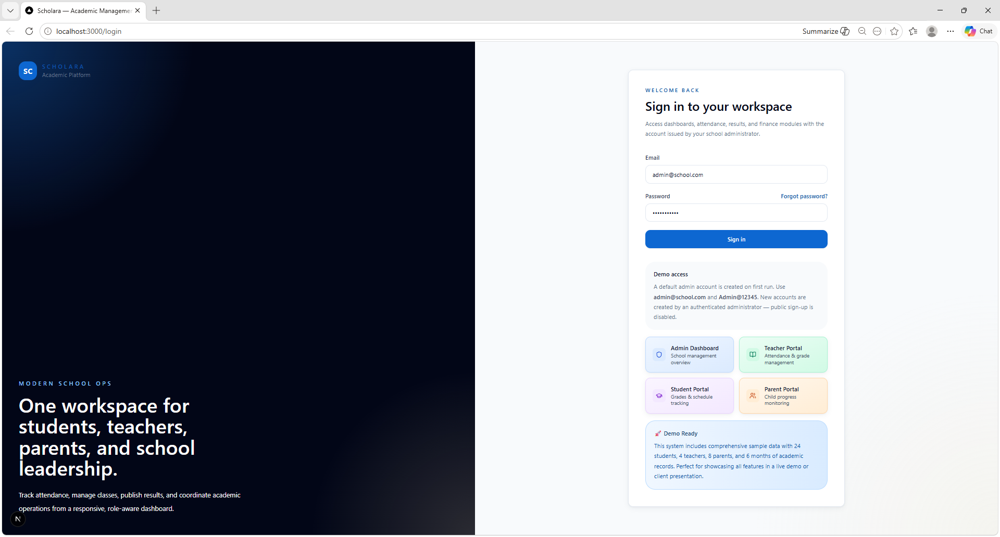 | 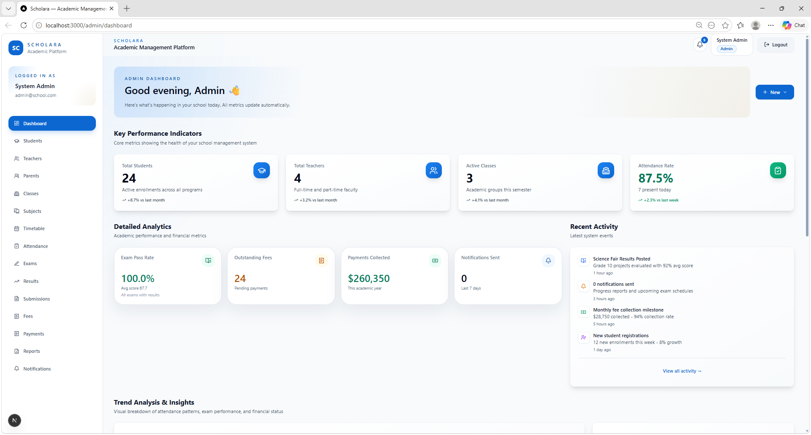 |

| Students                                   | Teachers                                   |
| ------------------------------------------ | ------------------------------------------ |
| 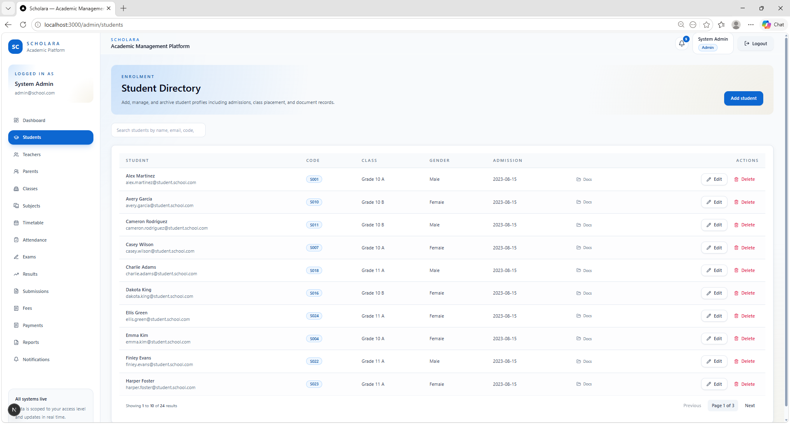 | 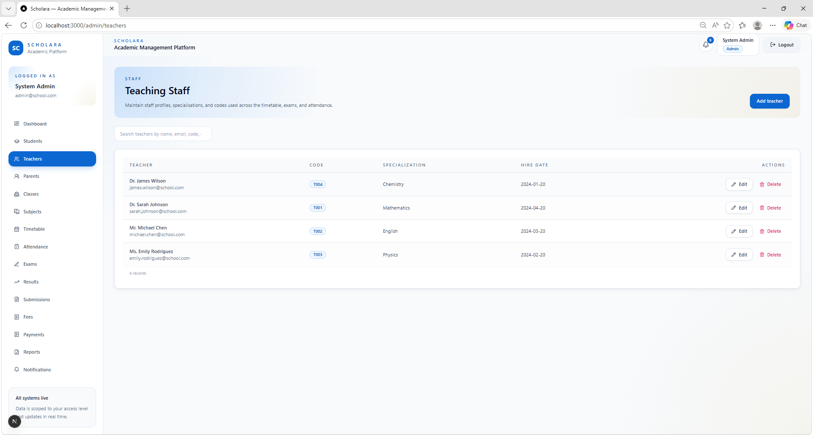 |

| Parents                                  | Classes                                  |
| ---------------------------------------- | ---------------------------------------- |
| 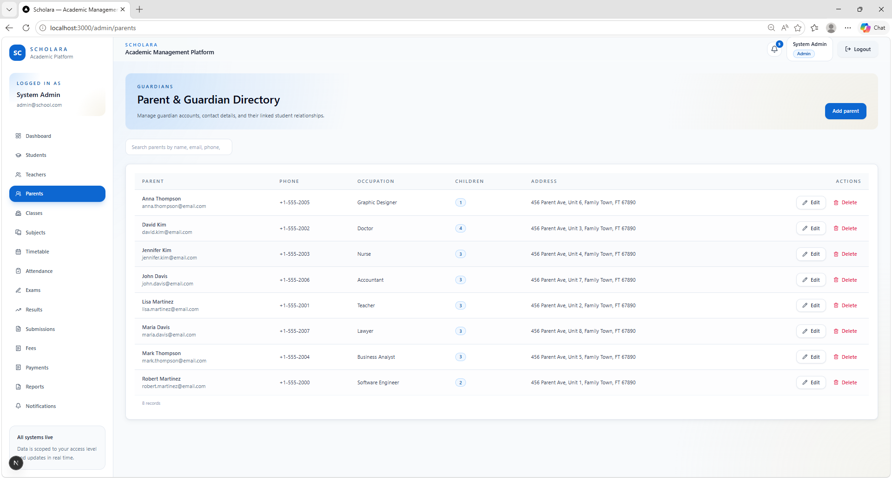 | 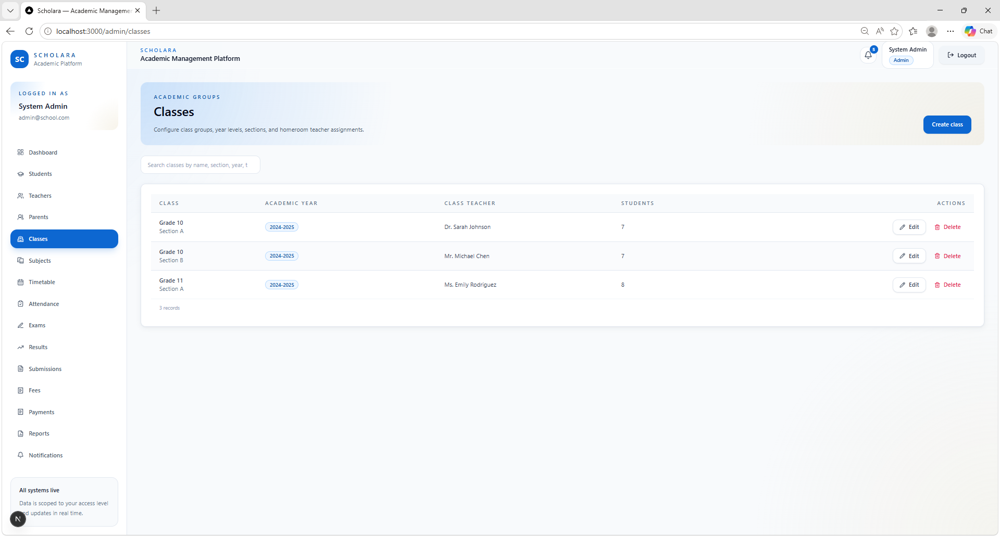 |

| Subjects                                   | Timetable                                    |
| ------------------------------------------ | -------------------------------------------- |
| 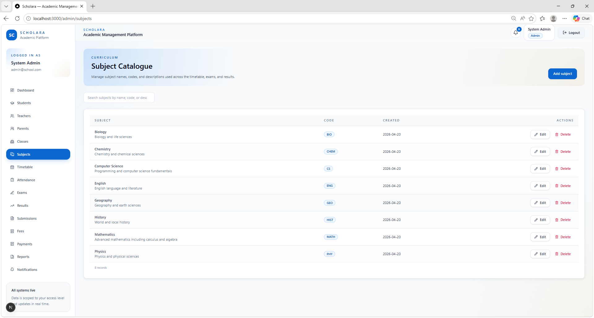 | 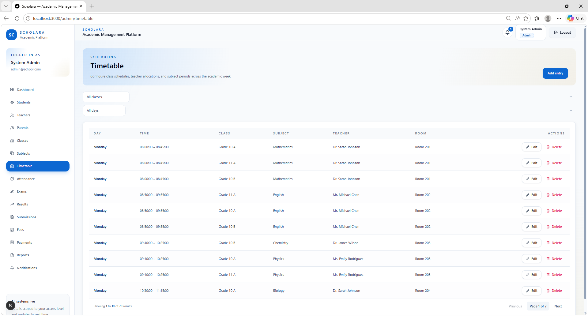 |

| Attendance Register                                              | Attendance History                                             |
| ---------------------------------------------------------------- | -------------------------------------------------------------- |
| 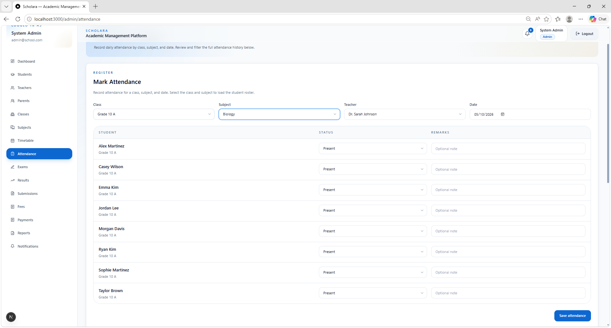 | 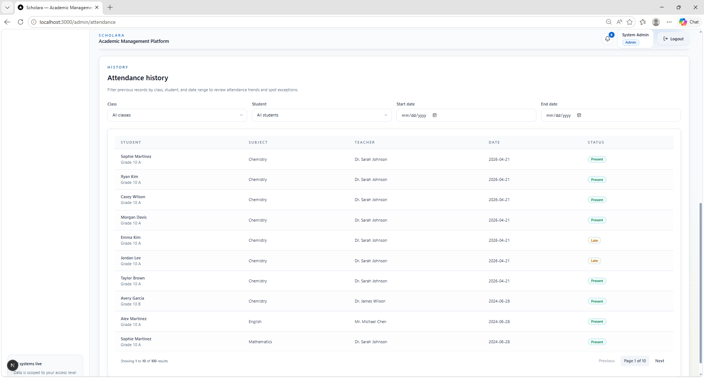 |

| Exams                                | Results                                  |
| ------------------------------------ | ---------------------------------------- |
| 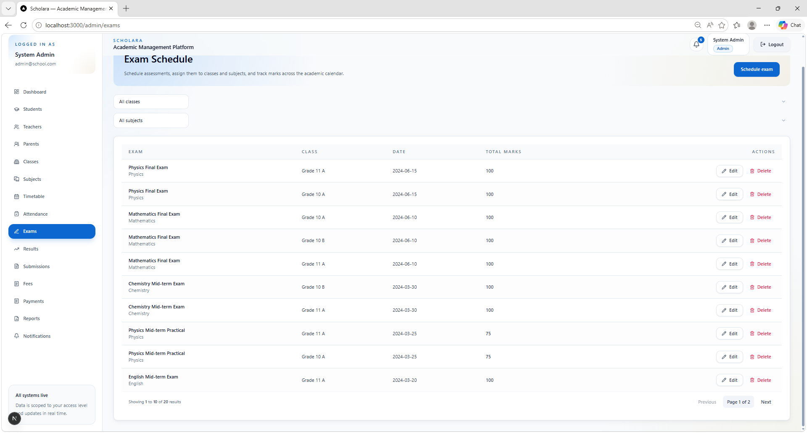 | 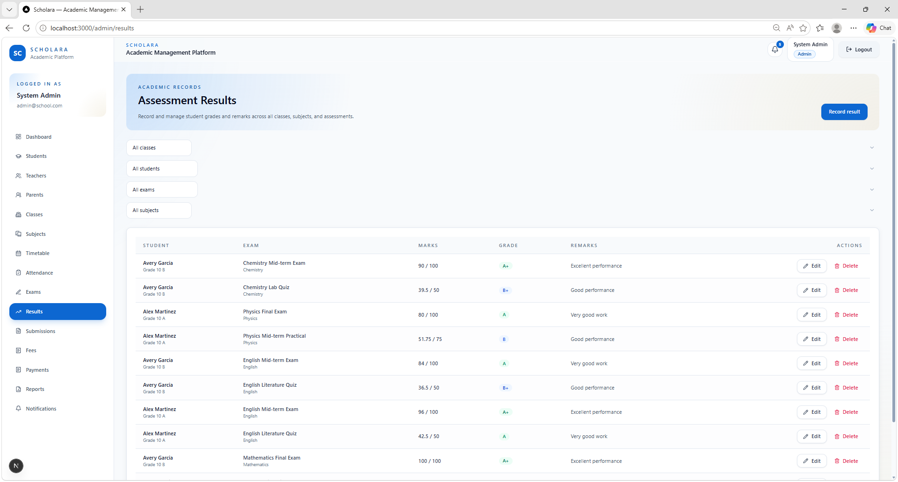 |

| Fees                               | Payments                                   |
| ---------------------------------- | ------------------------------------------ |
| 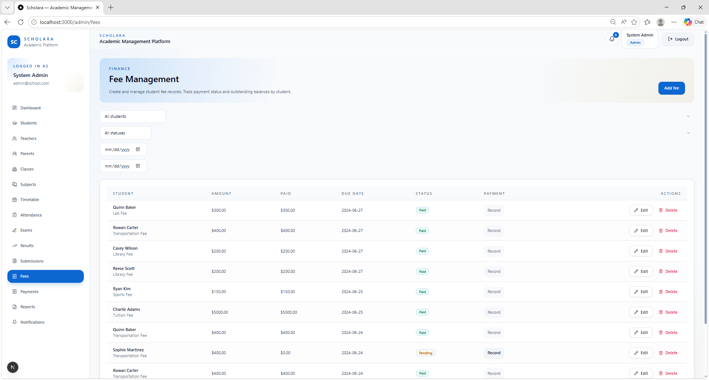 | 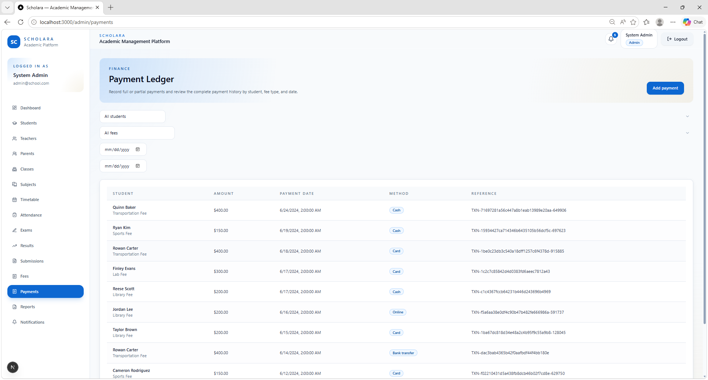 |

| Reports                                  | Notifications                                        |
| ---------------------------------------- | ---------------------------------------------------- |
| 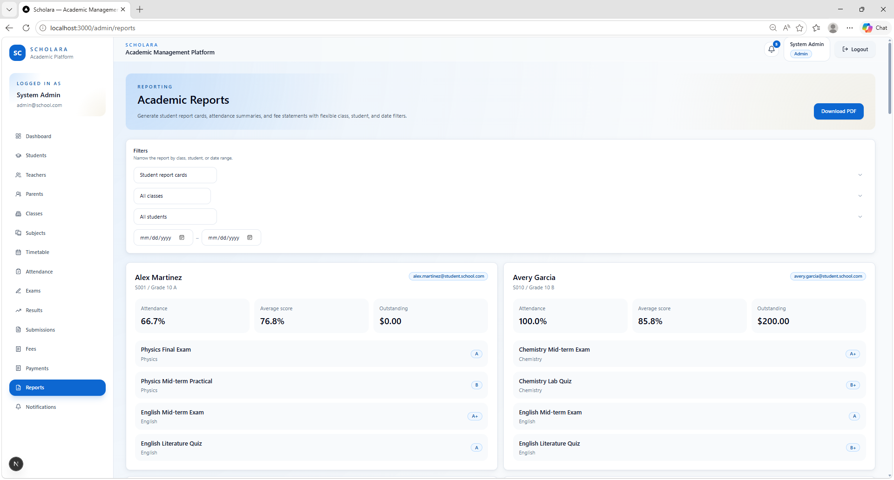 | 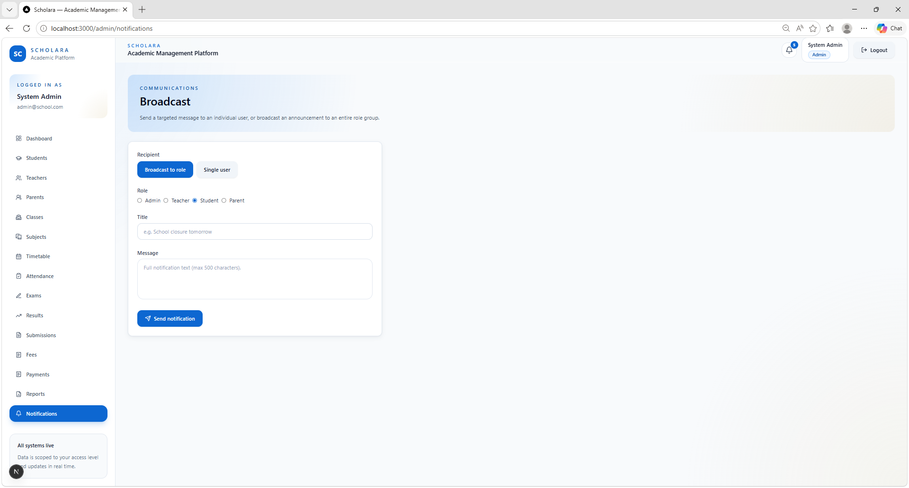 |

| Submissions                                      |     |
| ------------------------------------------------ | --- |
| 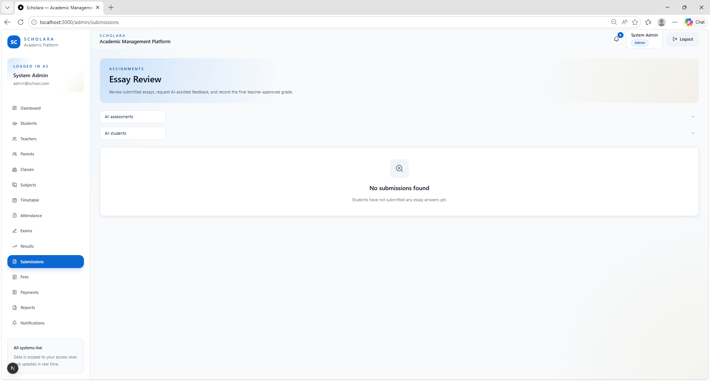 |     |

---

## Key Features & Capabilities

### Administrative Excellence

- **Student Management**: Student records, admissions data, profiles, and lifecycle tracking
- **Teacher Portal**: Teacher records, class assignments, attendance, grading, and communication tools
- **Parent Engagement**: Parent access to student progress, attendance, fees, and school notifications
- **Financial Management**: Fee tracking, payments, invoicing workflows, and idempotent payment handling
- **Academic Planning**: Classes, subjects, timetables, exams, results, and academic reporting

### Advanced Functionality

- **AI-Powered Grading**: Optional OpenAI-assisted essay evaluation where configured
- **PDF Report Generation**: QuestPDF-based reports for academic and operational data
- **Real-Time Notifications**: SignalR integration for live user notifications
- **Audit Logging**: Activity tracking for security and operational visibility
- **Responsive Interface**: Next.js and Tailwind CSS frontend designed for desktop and mobile use

### Security Features

- **JWT Authentication**: Access tokens with refresh token rotation
- **Role-Based Access Control**: Admin, Teacher, Student, and Parent authorization boundaries
- **Input Validation**: FluentValidation and request validation across backend workflows
- **Rate Limiting**: Protection against brute force and abusive request patterns
- **Security Headers**: OWASP-aligned HTTP security header configuration
- **File Upload Safety**: Security checks for upload workflows

---

## Technology Stack

| Layer                | Technology                                  | Purpose                                       |
| -------------------- | ------------------------------------------- | --------------------------------------------- |
| **Backend**          | ASP.NET Core 9 Web API                      | API layer, authentication, business workflows |
| **Frontend**         | Next.js 15, React, TypeScript, Tailwind CSS | Role-based web application                    |
| **Database**         | PostgreSQL 16                               | Relational data storage                       |
| **ORM**              | Entity Framework Core                       | Migrations, queries, persistence model        |
| **Authentication**   | JWT + Refresh Tokens                        | Secure stateless authentication               |
| **Validation**       | FluentValidation                            | Request and command validation                |
| **Logging**          | Serilog                                     | Structured application logging                |
| **PDF Generation**   | QuestPDF                                    | Report rendering                              |
| **Real-Time**        | SignalR                                     | Live notifications                            |
| **Backend Testing**  | xUnit, Testcontainers                       | Integration and production-readiness testing  |
| **Frontend Testing** | Vitest, React Testing Library               | Component and UI behavior testing             |
| **Deployment**       | Docker Compose                              | Local and server deployment foundation        |

---

## Portfolio Highlights

- **Clean Architecture** with separated API, Application, Domain, Infrastructure, and Persistence layers
- **RBAC authorization** across Admin, Teacher, Student, and Parent workflows
- **JWT authentication** with refresh token support
- **PostgreSQL schema and EF Core migrations** for relational data integrity
- **SignalR realtime notifications** for live application updates
- **Payment idempotency** to prevent duplicate payment records during retries
- **PDF reports** generated with QuestPDF
- **Docker Compose deployment** for repeatable environment setup
- **Automated tests** covering backend, frontend, security, realtime, and database behavior
- **Professional documentation** for API contracts, backend architecture, frontend architecture, and deployment

---

## Quick Start - Deploy in Minutes

### Docker Deployment

```bash
# 1. Clone and configure
git clone <repository-url>
cd school-management-system
cp .env.example .env

# 2. Configure essential settings in .env
# - JWT_SECRET_KEY: strong random secret, at least 32 characters
# - POSTGRES_PASSWORD: secure database password
# - FRONTEND_ORIGIN: frontend URL
# - DATABASE_AUTO_MIGRATE=false for production
# - DATABASE_SEED_DEMO_DATA=false for production

# 3. Start the application
docker compose up --build -d

# 4. Access the system
# Frontend: http://localhost:3000
# API: http://localhost:5000
```

Demo data is created only when `DATABASE_SEED_DEMO_DATA=true` in a non-production environment.

### Manual Development Setup

```bash
# Prerequisites
# - .NET SDK 9
# - Node.js 22 LTS
# - PostgreSQL 16

# Backend
dotnet ef database update --project src/SchoolManagement.Persistence
dotnet run --project src/SchoolManagement.API

# Frontend
cd frontend
npm install
npm run dev
```

| Service      | URL                                                |
| ------------ | -------------------------------------------------- |
| Frontend     | http://localhost:3000                              |
| API          | http://localhost:5000                              |
| Health check | http://localhost:5000/health                       |
| Swagger UI   | http://localhost:5000/swagger _(Development only)_ |
| PostgreSQL   | localhost:5432                                     |

---

## System Architecture

### Clean Architecture Pattern

```text
School Management System
|
|-- Presentation Layer      ASP.NET Core controllers, middleware, SignalR hubs
|-- Application Layer       DTOs, service interfaces, validators, use-case logic
|-- Domain Layer            Entities, enums, core business rules
|-- Infrastructure Layer    JWT, hashing, PDF generation, external integrations
|-- Persistence Layer       EF Core DbContext, migrations, seed data
|-- Frontend Layer          Next.js App Router, React components, feature modules
```

### Database Schema

- **Users & Roles**: Multi-role authentication and authorization model
- **Academic Structure**: Classes, subjects, timetables, exams, results
- **Student Records**: Profiles, attendance, grades, submissions
- **Financial System**: Fees, payments, invoices, idempotency keys
- **Communication**: Notifications, messages, realtime events
- **Audit & Security**: Activity logs and security-relevant records

### Project Structure

```text
.
|-- src/
|   |-- SchoolManagement.API/            Controllers, middleware, hubs, Program.cs
|   |-- SchoolManagement.Application/    DTOs, service interfaces, validators
|   |-- SchoolManagement.Domain/         Entities, enums, domain model
|   |-- SchoolManagement.Infrastructure/ JWT, hashing, PDF, dependency injection
|   `-- SchoolManagement.Persistence/    EF Core, migrations, seed data
|-- tests/
|   `-- SchoolManagement.Tests/          xUnit integration tests
|-- frontend/                            Next.js 15 App Router application
|-- database/                            Reference SQL schema
|-- docs/                                Additional documentation and screenshots
|-- docker-compose.yml
`-- .env.example
```

---

## User Roles & Capabilities

### Administrator

- Manage users, roles, students, teachers, and parents
- Configure classes, subjects, exams, timetables, and fees
- Review payments, reports, notifications, and audit data
- Maintain system-level operational settings

### Teacher

- Manage class attendance and academic records
- Create and review exams, results, and submissions
- Communicate with students and parents
- Track class-level progress and activity

### Student

- View dashboard, timetable, attendance, results, and submissions
- Track academic progress and school notifications
- Access personal profile and learning information

### Parent

- Monitor child attendance, results, fees, and notifications
- Review academic progress and school communication
- Stay informed about operational and financial updates

---

## Security & Compliance

### Security Features

- **Authentication**: JWT access tokens with refresh token rotation
- **Authorization**: Role-based access control for all major workflows
- **Input Validation**: Backend validation and malicious-input smoke coverage
- **Payment Idempotency**: Stable `idempotencyKey` support prevents duplicate payment rows during retries
- **Rate Limiting**: Protection against abusive request patterns
- **Audit Logging**: Activity tracking for operational and security visibility
- **Security Headers**: Hardened HTTP headers for browser-facing protection
- **File Upload Security**: Tests and validation around upload behavior

### Compliance-Oriented Foundations

- **Audit Trail**: Logging designed to support accountability and review
- **Data Protection**: Authentication, authorization, and validation controls
- **Configurable Deployment**: Environment-based configuration for production hardening
- **Secure Communication Ready**: Designed to run behind HTTPS in production

---

## Performance & Scalability

### Optimized for Production-Oriented Use

- **Database Performance**: Indexed queries and relational schema design
- **Stateless API Design**: Suitable for horizontal scaling behind a load balancer
- **Frontend Optimization**: Next.js build pipeline, code splitting, and typed UI modules
- **Health Checks**: API health endpoint for deployment monitoring
- **Structured Logging**: Serilog output suitable for centralized logging systems

### Scalability Foundations

- **Containerized Services**: Docker Compose foundation for repeatable deployments
- **PostgreSQL Compatibility**: Tested against the real Npgsql provider using Testcontainers
- **Separation of Concerns**: Clean Architecture supports future modularization
- **CDN Compatible Frontend Assets**: Next.js static asset handling supports common hosting patterns

---

## Deployment Options

### Cloud Deployment

- **AWS**: ECS, RDS, ALB, or similar container-based hosting
- **Azure**: App Service, Container Apps, Azure Database for PostgreSQL
- **Google Cloud**: Cloud Run and Cloud SQL
- **DigitalOcean**: App Platform, Droplets, and Managed PostgreSQL

### On-Premise Deployment

- **Docker Compose**: Single-server deployment foundation
- **Linux Servers**: Suitable for Ubuntu and similar server distributions
- **Windows Server**: Can be adapted for IIS or container-based hosting
- **Reverse Proxy Ready**: Intended to run behind Nginx, Caddy, Traefik, IIS, or a cloud load balancer

---

## Production Readiness

This project has a production-ready architecture and a deployment-ready foundation. It is suitable for professional portfolio review and university/project presentation because it includes real authentication, authorization, database migrations, automated tests, Docker deployment, security checks, and documented configuration.

Actual production deployment still requires environment-specific hardening, including proper secrets management, HTTPS reverse proxy configuration, persistent Data Protection keys, database backups, monitoring, log aggregation, email/provider configuration, and secure infrastructure settings.

### Production Checklist

- [ ] Set a strong random `JWT_SECRET_KEY` with at least 32 characters
- [ ] Change `POSTGRES_USER` and `POSTGRES_PASSWORD`
- [ ] Set `FRONTEND_ORIGIN` and `FRONTEND_ORIGIN_ALT` to deployed frontend URLs
- [ ] Set `PASSWORD_RESET_FRONTEND_URL` to the deployed reset-password page
- [ ] Set `DATABASE_AUTO_MIGRATE=false` in production
- [ ] Set `DATABASE_SEED_DEMO_DATA=false` in production
- [ ] Keep `DATABASE_ALLOW_PRODUCTION_AUTO_MIGRATE=false` unless running a deliberate one-off migration window
- [ ] Configure persistent ASP.NET Core Data Protection keys
- [ ] Place the API and frontend behind HTTPS
- [ ] Configure backups, monitoring, alerting, and log retention

### Production Configuration Safety

The API fails fast when `ASPNETCORE_ENVIRONMENT=Production` and unsafe settings are present:

- demo or development JWT secrets are rejected
- `DATABASE_SEED_DEMO_DATA=true` is rejected
- `DATABASE_AUTO_MIGRATE=true` is rejected unless `DATABASE_ALLOW_PRODUCTION_AUTO_MIGRATE=true` is explicitly set

The default `docker-compose.yml` is development-oriented and requires `JWT_SECRET_KEY` to be provided instead of falling back to a demo secret. For production, use `.env.production.example` as the starting point and replace all `CHANGE_ME` values before deployment.

---

## Demo & Evaluation

### Demo Credentials

When `DATABASE_SEED_DEMO_DATA=true` in a non-production environment, the following admin account is created automatically:

```text
Email:    admin@school.com
Password: Admin@12345
Role:     Admin
```

---

## Target Customers

### Educational Institutions

- **K-12 Schools**: Administration, attendance, grading, fees, and parent engagement
- **Colleges & Universities**: Academic records, reporting, and role-based workflows
- **Training Centers**: Course-style management, progress tracking, and communication
- **Language Schools**: Student progress, attendance, payments, and reports

### Service Providers

- **Educational Consultants**: Customizable platform foundation for client institutions
- **IT Service Companies**: Source-available base for education-sector projects
- **Government or Non-Profit Programs**: Adaptable system for structured educational administration
- **Student Developers**: Strong reference project for full-stack architecture and testing practices

---

## Why Choose This System?

### For Educational Institutions

- **Complete Workflow Coverage**: Core school administration features in one application
- **Role-Specific Portals**: Clear separation of Admin, Teacher, Student, and Parent responsibilities
- **Deployment-Ready Foundation**: Docker Compose setup and environment-based configuration
- **Security-Aware Design**: Authentication, authorization, validation, rate limiting, and audit logging

### For Developers & Agencies

- **Clean Codebase Structure**: Layered architecture with clear project boundaries
- **Extensible Foundation**: Designed for additional modules and institution-specific customization
- **Modern Stack**: ASP.NET Core 9, Next.js 15, TypeScript, PostgreSQL, and Docker
- **Professionally Tested**: Backend, frontend, database, security, realtime, and validation coverage

### Competitive Advantages

- **All-in-One Academic Operations**: Users, academics, finance, reporting, and notifications
- **Realtime Capability**: SignalR-based live notifications
- **Mobile-Friendly Frontend**: Responsive Next.js interface
- **Optional AI Integration**: Configurable OpenAI-assisted grading workflow
- **Audit-Ready Foundation**: Activity tracking and security-conscious backend design

---

## Testing & Quality Assurance

The project includes automated backend and frontend test coverage for core application behavior, security boundaries, database behavior, realtime notifications, and UI workflows.

### Backend Quality

- **xUnit integration tests** for API behavior and application workflows
- **PostgreSQL Testcontainers** coverage against the real PostgreSQL/Npgsql provider
- **Security tests** for authentication, authorization, CORS, rate limiting, security headers, and malicious input smoke cases
- **SignalR integration tests** for realtime notification behavior
- **File upload security tests** for upload validation and hardening
- **Pagination validation tests** for request boundary handling
- **Payment idempotency tests** for retry and concurrency behavior
- **Startup configuration safety tests** for production misconfiguration detection

### Frontend Quality

- **Vitest tests** for frontend logic and feature behavior
- **React Testing Library** tests for component rendering and user interactions
- **Lint clean result** with `0 errors` and `0 warnings`
- **Production build succeeded** through the Next.js build pipeline

### Quality Commands

```bash
# Backend build and tests
dotnet build SchoolManagement.sln -v minimal
dotnet test tests/SchoolManagement.Tests/SchoolManagement.Tests.csproj -v minimal

# Fast backend suite without PostgreSQL Testcontainers
dotnet test tests/SchoolManagement.Tests/SchoolManagement.Tests.csproj --filter "Category!=PostgreSQL"

# Security integration tests
dotnet test tests/SchoolManagement.Tests/SchoolManagement.Tests.csproj --filter Security

# PostgreSQL-backed integration tests
# Requires Docker Desktop or a reachable Docker daemon.
dotnet test tests/SchoolManagement.Tests/SchoolManagement.Tests.csproj --filter Category=PostgreSQL

# Frontend tests and build
cd frontend
npm run lint
npm test
npm run build
```

The default SQLite-backed backend tests provide fast API regression coverage. The PostgreSQL Testcontainers suite verifies EF Core migrations, schema/index integrity, PostgreSQL constraints, and payment idempotency under retry/concurrency conditions.

---

## Support & Documentation

### Documentation

- **[API Documentation](API_CONTRACT.md)**: API reference and request/response contracts
- **[Deployment Guide](DEPLOYMENT.md)**: Deployment instructions and operational notes
- **[Backend Architecture](BACKEND.md)**: Backend implementation and architectural overview
- **[Frontend Guide](FRONTEND.md)**: Frontend structure and customization guidance
- **[Database Structure](DATABASE_STRUCTURE.md)**: Database schema reference
- **[Production Deployment](DEPLOYMENT_PRODUCTION.md)**: Production-oriented deployment details

---

## License & Pricing

### MIT License

- **Commercial Use**: Allowed
- **Modification**: Allowed
- **Distribution**: Allowed
- **Private Use**: Allowed
- **Warranty**: Software provided "as is" without warranty

### Value Proposition

- **Zero Licensing Costs**: No per-user or per-school license fees
- **Complete Source Code**: Full ownership and customization rights under the MIT license
- **No Vendor Lock-In**: Deploy, modify, and extend the system independently
- **Strong Learning Value**: Demonstrates full-stack architecture, security, testing, and deployment practices

---

## Start Evaluating the Project

1. **Run with Docker**: Start the full stack using `docker compose up --build -d`
2. **Review the UI**: Sign in with seeded demo credentials in a non-production environment
3. **Inspect the API**: Use Swagger in development or review `API_CONTRACT.md`
4. **Run the Tests**: Validate backend, frontend, database, security, and realtime behavior
5. **Customize Safely**: Extend features through the existing Clean Architecture boundaries

---

## Expected Screenshot Files

The README references the following files:

```text
docs/screenshots/login.png
docs/screenshots/admin-dashboard.png
docs/screenshots/students.png
docs/screenshots/teachers.png
docs/screenshots/parents.png
docs/screenshots/classes.png
docs/screenshots/subjects.png
docs/screenshots/timetable.png
docs/screenshots/attendance-register.png
docs/screenshots/attendance-history.png
docs/screenshots/exams.png
docs/screenshots/results.png
docs/screenshots/fees.png
docs/screenshots/payments.png
docs/screenshots/reports.png
docs/screenshots/notifications.png
docs/screenshots/submissions.png
```

---

_Built as a production-oriented, professionally tested school management platform for portfolio, academic, and deployment evaluation._
